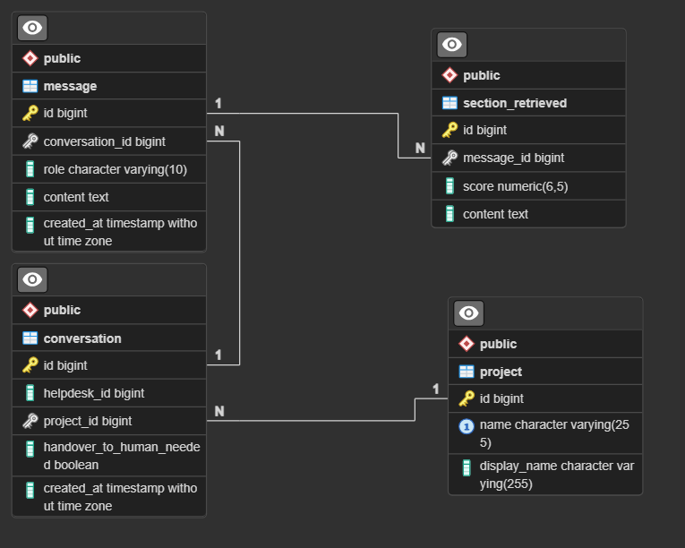

# SmartChat - Assistente Virtual com RAG


## 📝 Visão Geral

Este projeto implementa a técnica **RAG (Retrieval Augmented Generation)** para responder perguntas com base em contexto armazenado em um mecanismo de busca vetorial (Azure Search). Utiliza-se o modelo GPT da OpenAI para geração de respostas mais ricas e personalizadas.

### Tecnologias Principais:

- Java + Spring Boot
- Spring Cloud OpenFeign
- OpenAI Embeddings + GPT
- Banco de dados vetorial Azure AI Search
- Banco de dados relacional H2
- Docker

---

## 🚀 Começando

### Pré-requisitos

- Docker
- Java 17+ (caso queira rodar sem Docker)
- Chave de API da OpenAI
- Token da Azure Cognitive Search com índice previamente configurado e populado

### ⚙️ Executando o Projeto

### 1. Clone o repositório:
```
git clone https://github.com/fabiobastian/SmartChat.git
cd SmartChat
```

### 2. Faça o build da imagem usando docker
```
docker build -t smartchat . 
```

### 3. Configure as variáveis de ambiente:

Crie um arquivo **.env** na raiz do projeto com o seguinte conteúdo:
```
OPENAI_API_KEY=<sua_chave_aqui>
AZURE_SEARCH_API_KEY=<sua_chave_aqui>
```
A criação do .env é opcional, mas facilita a execução do contêiner.

### 4. Execute o contêiner com Docker

Com **.env**
```
docker run -d --env-file .env -p 8080:8080 smartchat
```
Sem **.env**
```
docker run -d -p 8080:8080 -e "OPENAI_API_KEY=<sua_chave_aqui>" -e "AZURE_SEARCH_API_KEY=<sua_chave_aqui>" smartchat
```

## 🌐 Acessos Úteis

### Swagger

http://localhost:8080/swagger-ui/index.html

Interface para testar facilmente os endpoints da API.

### Console H2

http://localhost:8080/h2-console

Banco relacional em memória (estilo SQLite) embutido no Spring Boot. Só estará acessível enquanto a aplicação estiver em execução.

Configurações de acesso:

- Driver Class:	org.h2.Driver
- JDBC URL: jdbc:h2:file:/app/data/h2db
- User Name: sa
- Password: (deixe em branco)

Se estiver rodando fora do Docker, altere o **JDBC URL** para:

jdbc:h2:file:./data/h2db

As configurações podem ser personalizadas no arquivo application.properties.

## 🧠 Principais Decisões Técnicas

### Java + Spring Boot

- Produtividade com robustez: Usei Java com Spring Boot por oferecer rapidez no desenvolvimento de APIs RESTful com qualidade de produção. A estrutura do framework favorece a organização do projeto em camadas bem definidas.

- Feign Client para comunicação externa: Escolhi OpenFeign por permitir chamadas HTTP limpas e tipadas, facilitando a integração com a API da OpenAI com pouco código e alta legibilidade.

- Fácil integração com banco de dados, e opções de banco de dados como o H2 que se integra muito bem com o JPA, mantendo a modularidade, podendo ser migrado facilmente para bancos de dados como PostgreSQL ou Oracle.

### Embeddings

- Problema: Recebo diversas mensagens, como as devo processar?

Para resolver este problema adotei a estratégia de, unir todas as mensagens vindas por meio da rule=user, e remover as saudações do usuário, como Hello, Morning, etc. Retiro as saudações por elas não trazerem um valor semântico a frase, com está grande frase faço o embedding e posteriormente pesquiso as perguntas+respostas correspondentes no Azure.

Posteriormente com todas as informações em mãos, faço o prompt para enviar para o ChatGPT, porém não envio a mensagem com as saudações retiradas, envio a mensagem original do usuário, para que assim a IA consiga responder da forma mais natural possível, saudando o usuário de volta.

### Escalar para N2

- Problema: Em qual momento, e qual estratégia devo utilizar para escalar o problema para N2?

Adotei a estratégia de **Option 2: Handover Feature**, que basicamente diz que: quando o banco vetorial retornar uma resposta do type=N2, o atendimento deve ser escalado para um atendente humano, enviando o handoverToHumanNeeded: true na resposta.

Acredito que por se tratar de uma POC está seja a solução mais viável, por conta da feature de esclarecimento não estar muito clara quais devem ser os parâmetros utilizados, e ser muito mais regras de negócio.

### Banco de Dados



Escolhi por implementar um banco de dados relacional na minha aplicação, acredito que numa implementação maior, utilizando microsserviços, está minha API seja apenas um pequeno pedaço com responsabilidade limitada a geração de respostas a partir de uma entrada bem definida.

Porém, como gostaria de mostrar mais o que sei, decide fazer um ecosistema maior, com mais responsabilidades, como a gerência de projetos conforme o project.name, e com isso ter o controle das diferentes mensagens, conversas e também guardar os contextos resgatadas da Azure.

Com este esquema de banco de dados é possível cadastrar mais projetos, conforme o nome e ‘slogan’ do cliente, mudando assim onde é buscado na Azure e a quem a IA responde como assistente.

Também é possível ter o histórico completo de conversar, e mensagens trocadas entre o usuário e o assistente(IA), podendo assim retornar ao cliente no front de forma simples.

Com o histórico de mensagens trocadas e os contextos resgatados salvos, podemos assim se for preciso, antes mesmo de receber a pergunta do usuário, podemos contextualizar a IA para assim receber a resposta mais precisa, também pode ser projetado para dígamos, sempre contextualizar a IA com as últimas perguntas feitas num intervalo de 15 minutos, assim utilizando na resposta um contexto mais amplo.

Seguindo mais no âmbito do chatbox, usando as perguntas feitas pelo usuário, os contextos resgatados, e as respostas dada pelo assistente(IA), conseguimos avaliar a assertividade do modelo, utilizando IAs treinadas para avaliar as respostas, e assim dar nota para cada resposta/atendimento.


## Fluxo do Chatbot

- Recebe a pergunta do usuário
- Gera embeddings da pergunta
- Busca trechos relevantes no banco vetorial
- Envia pergunta + contexto para o LLM gerar a resposta


## 📌 Observações

- Certifique-se de que o índice no Azure Search já está criado e populado antes de iniciar a aplicação.
- A aplicação está configurada para ser facilmente executada via Docker, mas também pode rodar localmente com Maven.